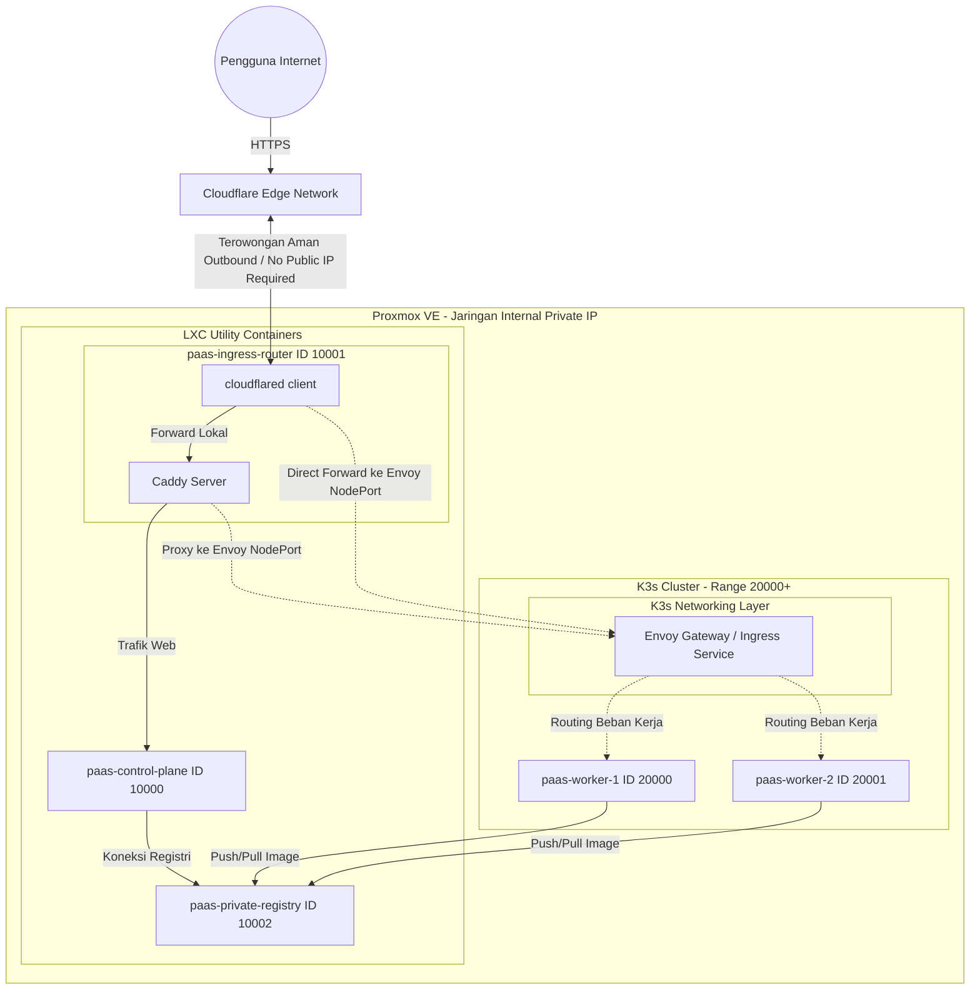

# Arsitektur Infrastruktur VM dan LXC Proxmox

Dokumen ini memuat konfigurasi infrastruktur virtualisasi yang digunakan untuk mendukung platform dyzulk-cloud PaaS di kluster Proxmox Anda.

## Pembagian Alokasi ID Virtualisasi
Sesuai dengan keputusan standardisasi (Opsi 3), rentang ID virtualisasi dipisahkan berdasarkan tipe resource untuk memudahkan pengelolaan dan automasi:
* LXC (Linux Container) dialokasikan pada rentang 10000+ (digunakan untuk control plane, ingress, registry, dan layanan utilitas).
* VM (KVM Virtual Machine) dialokasikan pada rentang 20000+ (digunakan untuk node pekerja / runner yang menjalankan beban kerja kontainer pengguna).

## Detail Resource Virtual
1. paas-control-plane (LXC - ID 10000)
   * IP Address (DHCP): 10.20.20.10
   * MAC Address: BC:24:11:6B:75:FF
   * Peran: Dasbor kontrol utama Laravel, billing, penanganan webhook git, dan manajemen state.

2. paas-ingress-router (LXC - ID 10001)
   * IP Address (DHCP): 10.10.10.10
   * MAC Address: BC:24:11:D5:1A:5E
   * Peran: Gerbang masuk (Ingress) utama. Menjalankan Caddy Server sebagai reverse proxy internal serta agen Cloudflare Tunnel (cloudflared) khusus untuk lalu lintas PaaS.

3. paas-private-registry (LXC - ID 10002)
   * IP Address (DHCP): Diakses via Ingress port 5000
   * MAC Address: BC:24:11:71:D7:1C
   * Peran: Menyimpan Docker images hasil build aplikasi pengguna secara lokal dan privat.

4. paas-worker-1 (VM - ID 20000)
   * IP Address (DHCP): 10.30.30.11
   * MAC Address: BC:24:11:00:F8:26
   * Peran: Runner node pertama untuk menjalankan container aplikasi pengguna.

5. paas-worker-2 (VM - ID 20001)
   * IP Address (DHCP): 10.30.30.12
   * MAC Address: BC:24:11:5E:1A:AB
   * Peran: Runner node kedua untuk beban kerja aplikasi pengguna.

---

## Ilustrasi Arsitektur Khusus Cloudflare Tunnel (Tanpa IP Publik)
Berikut adalah bagan visual bagaimana lalu lintas data dari luar masuk ke kluster Proxmox lokal Anda melalui terowongan aman Cloudflare Tunnel (cloudflared) yang terpasang di dalam paas-ingress-router (LXC 10001):

---

## Audit Kesiapan K3s + Envoy (Status Konfigurasi Node)

Jika Anda ingin menerapkan K3s (Kubernetes) dengan Envoy Proxy di kluster Proxmox ini, disarankan agar node yang ditunjuk sebagai control plane maupun worker K3s berada dalam kondisi bersih (default/fresh installation) untuk menghindari konflik port (seperti 80, 443, 6443, 10250) dan tumpang tindih firewall/runtime (seperti Docker vs Containerd).

Berdasarkan hasil pemindaian langsung terhadap VM dan LXC aktif dalam kluster Anda, berikut adalah status kesiapannya:

### 1. VM Pekerja (Worker Nodes) - Siap untuk K3s
* paas-worker-1 (VM 20000): Bersih / Default (Fresh)
  * Status Audit: Tidak ditemukan Docker, Containerd, Nginx, Caddy, atau PHP.
  * Kesiapan: Sangat siap digunakan sebagai K3s Node.
* paas-worker-2 (VM 20001): Bersih / Default (Fresh)
  * Status Audit: Tidak ditemukan Docker, Containerd, Nginx, Caddy, atau PHP.
  * Kesiapan: Sangat siap digunakan sebagai K3s Node.

### 2. LXC Kontrol & Ingress - Sudah Terkonfigurasi (Configured)
* paas-control-plane (LXC 10000): Terkonfigurasi (Laravel + Nginx + PHP)
  * Status Audit: Menjalankan Nginx dan PHP-FPM untuk Dasbor Laravel.
  * Kesiapan: Tidak disarankan untuk dijadikan Node K3s karena adanya batasan isolasi LXC default untuk Kubernetes dan potensi bentrok port/layanan Laravel. Sebaiknya tetap biarkan kontainer ini berjalan secara terpisah sebagai antarmuka API/dashboard platform Anda.
* paas-ingress-router (LXC 10001): Terkonfigurasi (cloudflared + Caddy)
  * Status Audit: Menjalankan Caddy Server sebagai reverse proxy utama dan agen Cloudflare Tunnel (cloudflared).
  * Kesiapan: Kontainer ini aktif melayani terowongan PaaS. Ketika beralih ke Envoy di K3s, Caddy di dalam kontainer ini dapat disesuaikan untuk meneruskan trafik ke Envoy, atau dinonaktifkan jika terowongan cloudflared dihubungkan langsung ke IP internal Envoy.
* paas-private-registry (LXC 10002): Terkonfigurasi (Docker Registry)
  * Status Audit: Khusus untuk penyimpanan image Docker privat.
  * Kesiapan: Tetap pertahankan. K3s dapat dikonfigurasi melalui berkas registries.yaml agar mempercayai registri lokal ini untuk penarikan image (image pulling).

---

## Analisis Khusus untuk Arsitektur Tanpa IP Publik & Cloudflare Tunnel
Dengan tidak adanya IP publik di jaringan lokal Anda, integrasi K3s dan Envoy Proxy memiliki karakteristik unik berikut:

### 1. Manajemen Lalu Lintas (Traffic Ingress Flow)
* Seluruh lalu lintas web masuk dari internet publik ke PaaS ditangani secara terpusat oleh agen cloudflared yang berjalan di dalam paas-ingress-router (LXC 10001).
* Agen cloudflared melakukan koneksi keluar (outbound) yang aman ke jaringan Cloudflare Edge, mengeliminasi kebutuhan membuka port modem lokal.

### 2. Skenario Integrasi K3s + Envoy
Ada tiga pilihan jalur integrasi setelah K3s dan Envoy terpasang di VM 20000 and 20001:

* Skenario A (Proxy Bertingkat via Caddy):
  * Agen cloudflared di LXC 10001 meneruskan trafik ke Caddy (lokal LXC 10001).
  * Caddy dikonfigurasi ulang untuk melakukan reverse proxy dari LXC 10001 ke Envoy Ingress Service yang berjalan pada IP VM K3s (misal http://10.30.30.11:NodePort).
  * Kelebihan: Mudah diimplementasikan tanpa mengubah konfigurasi tunnel Cloudflare yang sudah ada di panel Zero Trust.

* Skenario B (Direct Tunnel dari LXC 10001 ke Envoy):
  * Di panel Cloudflare Zero Trust, ubah target perutean (Service URL) tunnel LXC 10001 langsung ke IP internal VM K3s (misal http://10.30.30.11:NodePort atau IP LoadBalancer internal K3s).
  * Caddy di LXC 10001 dapat dinonaktifkan sepenuhnya.
  * Kelebihan: Jalur trafik lebih pendek dan efisien karena bypass Caddy.

* Skenario C (Kubernetes-Native Tunnel):
  * Pindahkan agen cloudflared untuk berjalan langsung di dalam kluster K3s sebagai Deployment.
  * Terowongan cloudflared terhubung langsung ke Envoy Service menggunakan DNS internal Kubernetes.
  * Kelebihan: Pengelolaan infrastruktur terpusat di Kubernetes dan LXC 10001 dapat dihapus sepenuhnya.

### Kesimpulan & Rekomendasi Tindakan:
* Apakah perlu mendestroy VM/LXC yang tidak fresh?
  * Tidak perlu untuk VM pekerja (20000 & 20001), karena keduanya saat ini masih bersih (default/fresh) tanpa konfigurasi web server atau runtime lain. Anda bisa langsung menginstal K3s di sana.
  * Tidak perlu mendestroy paas-control-plane (10000), karena dasbor Laravel Anda harus tetap berjalan untuk memproses API and database. Kontainer ini cukup berjalan di luar kluster Kubernetes.
  * Hanya perlu menyesuaikan konfigurasi perutean di LXC 10001 (menggunakan Skenario A atau B) agar trafik diarahkan ke Envoy yang berjalan di atas kluster K3s.
