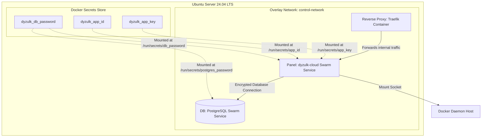

# Architecture Documentation: dyzulk-cloud Installer Script

This document details the architectural design, workflow, and security specifications of the installer script (`scripts/install.sh`) designed to initialize the **dyzulk-cloud** control plane and hosting infrastructure on **Ubuntu Server 24.04 LTS**.

---

## 1. Single-Server Architecture (Docker Swarm Mode)

The infrastructure utilizes a single-server **Docker Swarm Mode** topology to unify administrative controls and user container hosting within a single isolated virtual overlay network.



---

## 2. Installation Workflow (9-Step Flow)

The setup script is executed linearly through nine distinct validation, hardening, and initialization phases:

```mermaid
flowchart TD
    %% SYSTEM & DOCKER INITIALIZATION
    subgraph System Phase
        Step0[Step 0: Pre-flight Checks] --> Step1[Step 1: Check Disk Space]
        Step1 --> Step2[Step 2: Install Base Packages]
        Step2 --> Step3[Step 3: Setup Docker Engine]
        Step3 --> Step4[Step 4: Configure daemon.json]
    end

    %% SECURITY & ORCHESTRATION SETUP
    subgraph Security & Orchestration Phase
        Step4 --> Step5[Step 5: Integrate gVisor Sandbox]
        Step5 --> Step6[Step 6: Tune Kernel Parameters]
        Step6 --> Step7[Step 7: Setup Swarm & Docker Secrets]
    end

    %% STACK DEPLOYMENT & VERIFICATION
    subgraph Deployment Phase
        Step7 --> Step8[Step 8: Deploy Database & Panel Stack]
        Step8 --> Step9[Step 9: Health Check & Verification]
    end

    style System Phase fill:#f9f,stroke:#333,stroke-width:1px
    style Security & Orchestration Phase fill:#bbf,stroke:#333,stroke-width:1px
    style Deployment Phase fill:#bfb,stroke:#333,stroke-width:1px
```

---

## 3. Detailed Step Specifications

### Step 0: Pre-flight Checks

- Validates that the script is executed with `root` privileges.
- Confirms the host operating system is **Ubuntu Server 24.04+**.
- Verifies that the required public ports (`80`, `443`, and panel port `8000`) are not bound by other system services.

### Step 1: Check Disk Space

- Checks the disk space capacity on the root mount (`/`).
- Emits a non-blocking warning if the total space is under 30GB or the available space is under 20GB.

### Step 2: Install Base Packages

- Installs required packages from the standard repositories: `curl`, `wget`, `jq`, `openssl`, `ca-certificates`, `gnupg`, and `lsb-release`.

### Step 3: Setup Docker Engine

- Detects and blocks snap-based Docker installations due to socket permission limitations.
- Imports the official Docker GPG key, registers the official APT repository, and installs the latest major version of Docker Engine (minimum version 27).

### Step 4: Configure daemon.json

- Restricts the size of container log files (max 10MB per file with a rotation of 3 files) to prevent host storage exhaustion from client container logs.
- Configures `default-address-pools` (base `10.0.0.0/8`, size `24`) to ensure container networking CIDR ranges do not conflict with the host network.
- Registers the `runsc` (gVisor) runtime.

### Step 5: Integrate gVisor Sandbox

- Downloads `runsc` and `containerd-shim-runsc-v1` binaries directly from the Google storage repositories corresponding to the host CPU architecture (x86_64 or AArch64).
- Sets execution permissions and registers the gVisor container runtime integration.

### Step 6: Tune Kernel Parameters

- Enables IPv4 forwarding to facilitate cross-container virtual routing.
- Hardens the host network by enabling reverse path filtering (`rp_filter`).
- Adjusts `nf_conntrack_max` to `131072` to handle high connection concurrency from client container networking.

### Step 7: Setup Swarm & Docker Secrets

- Initializes Docker Swarm mode on the host.
- Creates the overlay network `control-network` with the `--attachable` flag.
- Generates and registers secure credentials in the Docker Secrets store (`dyzulk_db_password`, `dyzulk_app_key`, `dyzulk_app_id`).
- Generates a non-sensitive configuration file at `/data/dyzulk-cloud/source/.env`.

### Step 8: Deploy Database & Panel Stack

- **PostgreSQL (Database)**: Deployed as a Swarm Service inside `control-network` without exposing port 5432 to the host. The password is dynamically resolved via the secure `/run/secrets/db_password` mount.
- **Laravel Panel (Control Plane)**: Deployed as a Swarm Service with bind mounts for the host Docker socket (`/var/run/docker.sock`) to allow container scheduling.
- **Traefik (Reverse Proxy)**: Deployed as a standard standalone container with port mapping on `80` and `443` for dynamic routing using Docker's internal DNS.

### Step 9: Health Check & Verification

- Monitors Swarm service tasks until replica state reads `1/1`.
- Verifies proxy container state.
- Performs HTTP GET requests against the local panel port to verify successful rendering (HTTP 200) before finishing.

---

## 4. Security Infrastructure Details

1. **Credentials Encryption**: Database passwords and application keys are stored securely using Docker Secrets (encrypted at rest by Swarm). No plaintext secrets are stored in the host filesystem's `.env` configuration file.
2. **Container Sandbox (gVisor)**: User container deployments are forced to run using the `runsc` runtime. System calls are intercepted and virtualized, preventing privilege escalation exploits to the host kernel.
3. **Directory Isolation**: System data resides in `/data/dyzulk-cloud` with restricted access permissions (`chmod 700`), keeping configuration templates secure from non-root host users.
