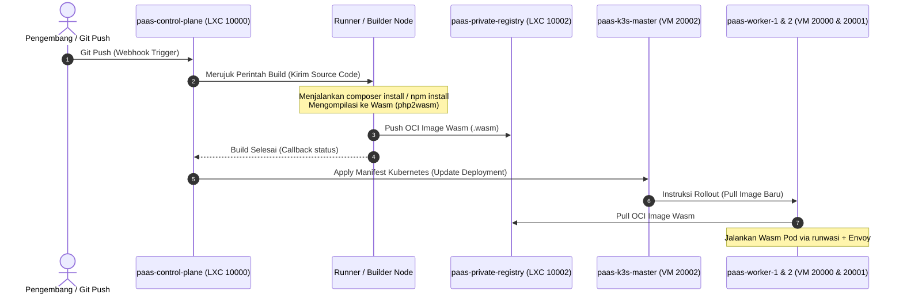

# Analisis Arsitektur Node: K3s, Envoy, dan WebAssembly untuk dyzulk-cloud

Dokumen ini meluruskan pemisahan peran antara **Controller**, **Runner (Builder)**, dan **Worker Node** dalam arsitektur platform PaaS dyzulk-cloud berbasis Kubernetes (K3s), Envoy, dan WebAssembly (Wasm).

---

## 1. Pemisahan Peran: Controller, Runner (Builder), dan Worker

Untuk memenuhi standar operasional bisnis cloud yang andal dan aman, siklus hidup kode pengguna dibagi menjadi tiga kelompok peran independen:

### A. Controller Node (Tingkat Administrasi & Orkestrasi)
* **paas-control-plane (LXC 10000)**: Dasbor Laravel yang memproses interaksi pengguna, billing, webhook Git, dan database platform.
* **paas-k3s-master (VM 20002)**: Menjalankan Kubernetes Control Plane. Menerima instruksi manifestasi dari Laravel dan menginstruksikan Worker Node untuk menarik image aplikasi baru.

### B. Runner Node (Tingkat Build & Kompilasi CI/CD)
* **Peran**: Bertindak seperti GitHub Actions Runner atau GitLab Runner.
* **Fungsi**: Ketika pengguna melakukan push kode ke repositori Git:
  1. Runner mengambil kode sumber tersebut.
  2. Menjalankan manajemen dependensi (seperti `composer install` atau `npm install`).
  3. Mengompilasi kode aplikasi menjadi biner WebAssembly (`.wasm`) menggunakan toolchain seperti `php2wasm`.
  4. Membungkus biner tersebut menjadi OCI Image (Wasm container) dan mendorongnya (*push*) ke **paas-private-registry (LXC 10002)**.
* **Karakteristik**: Beban kerja bersifat naik-turun secara drastis (*bursty CPU*) karena hanya aktif saat ada proses deploy baru. Node ini diisolasi penuh agar aktivitas kompilasi tidak mengganggu kinerja aplikasi yang sedang berjalan.

### C. Worker Node (Tingkat Eksekusi Produksi)
* **paas-worker-1 (VM 20000) & paas-worker-2 (VM 20001)**:
* **Peran**: Node komputasi produksi tempat aplikasi pengguna berjalan secara langsung (*live execution*).
* **Fungsi**: Worker Node menerima instruksi dari K3s Master, menarik OCI Image Wasm yang sudah matang dari Private Registry, dan menjalankannya menggunakan `containerd-shim-runwasi` serta menerima rute trafik dari Envoy Proxy.
* **Karakteristik**: Node ini harus selalu bersih dari proses instalasi, kompilasi, atau toolchain build (tidak ada compiler, npm, gcc, atau composer). Hal ini menjamin stabilitas performa aplikasi pengguna di lingkungan produksi.

---

## 2. Aliran Proses Build dan Deploy (CI/CD ke Produksi)

---

## 3. Keuntungan Arsitektur dengan Pemisahan Runner dan Worker

1. **Isolasi Beban Kerja (Resource Isolation)**:
   Proses kompilasi biner (build) sangat memakan resource CPU dan RAM. Dengan memisahkan Runner (Builder) ke node terpisah, proses kompilasi kode aplikasi baru tidak akan membuat aplikasi produksi yang sedang berjalan di Worker Node mengalami kelambatan (*CPU throttling*).

2. **Keamanan Lingkungan Produksi (Security Sandboxing)**:
   Proses instalasi dependensi pihak ketiga (misalnya via `composer` atau `npm`) rentan terhadap eksploitasi keamanan (seperti malware pada package library). Jika proses ini dijalankan di Runner Node yang terisolasi, risiko peretasan atau kerusakan hanya berdampak pada lingkungan build sementara, bukan pada Worker Node produksi.

3. **Efisiensi Penyimpanan & Dependensi**:
   Worker Node tidak memerlukan instalasi toolchain pengembangan (PHP CLI, Composer, Node.js, Webpack, Rust compiler, dll.). Worker Node hanya memerlukan runtime Kubernetes minimal (`k3s agent`) dan executor Wasm, sehingga sistem operasi Worker tetap ringan dan memiliki celah keamanan minimal (*attack surface* kecil).
