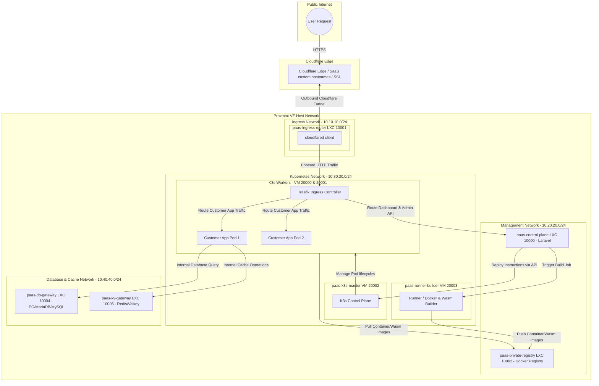
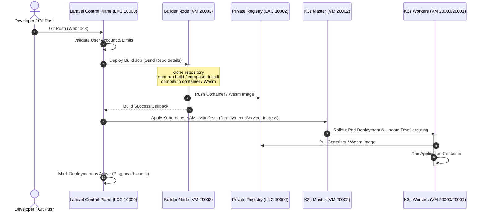

# Network and Kubernetes Architecture Design: dyzulk-cloud

This document outlines the architectural blueprint, network layout, and node configuration for the dyzulk-cloud PaaS platform running on a Debian-based Proxmox VE environment. It integrates Kubernetes (K3s) orchestration, a Laravel control plane, and a Cloudflare Tunnel-backed ingress system.

---

## 1. Ingress Router & Reverse Proxy Evaluation

To route incoming traffic (HTTP, HTTPS, TCP, UDP) into the Kubernetes cluster, we evaluate **OpenResty**, **Envoy**, and **Traefik**. Caddy has been excluded due to its stream features requiring external plugin installation.

### Comparison Matrix

| Criteria | OpenResty (Nginx + Lua) | Envoy Proxy | Traefik |
| :--- | :--- | :--- | :--- |
| **Language & Core** | C / Lua (High Performance) | C++ (Ultra-High Performance) | Go (High Performance) |
| **Kubernetes Native** | Low (Requires custom ingress controller / config reload script) | High (Via Envoy Gateway / Gateway API) | Outstanding (First-class Custom Resource Definitions / CRDs) |
| **Dynamic Configuration** | Moderate (Via Lua shared dict / APIs, but requires custom code) | Excellent (xDS API, hot restarts, zero downtime) | Excellent (Instant auto-discovery of K8s services) |
| **TCP/UDP Stream Routing** | Built-in (`ngx_stream_core_module`) | Built-in (Filter chains, SNI routing, TCP/UDP) | Built-in (`IngressRouteTCP` / `IngressRouteUDP` CRDs) |
| **Wasm Extensibility** | Limited / Experimental | Native (First-class WebAssembly filter support) | Limited (Via Go-based plugins / Yaegi interpreter) |
| **Configuration Complexity** | Moderate (Standard Nginx syntax + Lua scripts) | Extremely High (Complex bootstrap YAML / xDS configs) | Low (Declarative YAML, simple and readable) |

### Selected Strategy: Single-Proxy Architecture (Traefik Ingress)

To minimize network latency, avoid multiple proxy hops, and simplify configuration, dyzulk-cloud implements a **Single-Proxy Ingress Architecture**:

1. **Elimination of Public TCP Routing for Databases/Cache**: Since the cluster operates behind a Cloudflare Tunnel without public IP addresses, database (PostgreSQL, MariaDB, MySQL) and cache (Redis) products will not be exposed to the public internet over raw TCP. Instead, they are kept strictly private inside the internal Proxmox subnet, accessed only internally by customer applications. This renders edge TCP stream proxies redundant.
2. **Kubernetes-Native Ingress**: **Traefik** is selected as the sole Ingress Controller, running directly inside the K3s cluster. It dynamically detects routing configurations (Kubernetes `Ingress` or Traefik `IngressRoute` resources) applied by the Laravel control plane.
3. **Cloudflare for SaaS Integration**: SSL/TLS certificates for custom domains (e.g. `app.customer.com`) are managed and terminated at the Cloudflare Edge. Cloudflare routes these domains to a single Fallback Origin (`fallback.dyzulk.cloud`), which maps directly to the Cloudflare Tunnel. The tunnel client bridges traffic directly to the Traefik Ingress Controller inside K3s, which routes the request locally using the preserved `Host` header.

---

## 2. Infrastructure Node Layout (Proxmox VE)

Following the standard virtualization allocation, all services run on Debian templates:
* **LXC (Linux Containers) - Range 10000+**: Used for lightweight, stateful, or administrative utility services.
* **VM (KVM Virtual Machines) - Range 20000+**: Used for Kubernetes nodes, runners, and compute workloads requiring full kernel isolation and advanced networking.

### Virtual Machine & Container Mapping

| ID | Node Name | OS Template | Type | IP Allocation | Purpose / Role |
| :--- | :--- | :--- | :--- | :--- | :--- |
| **10000** | `paas-control-plane` | Debian | LXC | `10.20.20.10` | Laravel Control Plane (Dashboard, Billing, API, Git webhooks) |
| **10001** | `paas-ingress-router` | Debian | LXC | `10.10.10.10` | Tunnel Bridge: Runs `cloudflared` client (connects CF Edge to Traefik) |
| **10002** | `paas-private-registry`| Debian | LXC | `10.20.20.20` | Private Container Registry (Bind Mount on Host HDD 2TB) |
| **10004** | `paas-db-gateway` | Debian | LXC | `10.40.40.10` | Database Node: PostgreSQL, MariaDB, MySQL (Internal Access Only) |
| **10005** | `paas-kv-gateway` | Debian | LXC | `10.40.40.20` | Key-Value Node: Redis Cluster / Valkey (Internal Access Only) |
| **20002** | `paas-k3s-master` | Debian | VM | `10.30.30.10` | K3s Master (Kubernetes Control Plane) |
| **20003** | `paas-runner-builder` | Debian | VM | `10.30.30.20` | CI/CD Runner / Builder Node (Docker / Wasm compilation compiler) |
| **20000** | `paas-worker-1` | Debian | VM | `10.30.30.11` | K3s Worker Node 1 (Runs Traefik Ingress & Customer Pods) |
| **20001** | `paas-worker-2` | Debian | VM | `10.30.30.12` | K3s Worker Node 2 (Runs Traefik Ingress & Customer Pods) |

---

## 3. Network Architecture & Traffic Flow

The network is partitioned into distinct subnets to isolate administrative, compute, and database traffic:
* **Public Ingress Subnet (`10.10.10.0/24`)**: Contains the Tunnel Bridge. Directly communicates with Cloudflare via outbound tunnel.
* **Management & Control Subnet (`10.20.20.0/24`)**: Contains the Laravel Control Plane and Private Container Registry. Orchestrates VMs and handles local image registry access.
* **Kubernetes Internal Subnet (`10.30.30.0/24`)**: K3s Master, Workers, and Builder nodes.
* **Storage & Database Subnet (`10.40.40.0/24`)**: Databases and Key-Value stores.

### Traffic Flow Diagram



---

## 4. Detailed Node Specifications

### 4.1 Ingress Router (`paas-ingress-router` - LXC 10001)
* **Configuration**: Runs only the `cloudflared` client.
* **Role**:
  * Establishes outbound connections to Cloudflare Edge.
  * Acts as a network bridge, forwarding all HTTP/HTTPS traffic to the Traefik Ingress Controller service running inside the K3s VM cluster (LoadBalancer/NodePort IP).
  * Requires zero routing logic or dynamic reload scripts; its configuration is static.
* **Network Isolation**: Dual-homed on `10.10.10.0/24` and `10.30.30.0/24`.

### 4.2 Control Plane (`paas-control-plane` - LXC 10000)
* **Configuration**: Nginx + PHP-FPM (Laravel Application).
* **Role**:
  * Houses the management database for dyzulk-cloud (customers, billings, deployments metadata).
  * Receives webhook notifications from GitHub/GitLab.
  * Manages the K3s API by issuing kubectl commands or using the Kubernetes client SDK.
  * Orchestrates builder triggers and monitors deployment health.

### 4.3 Private Container Registry (`paas-private-registry` - LXC 10002)
* **Configuration**: Runs the official `registry:2` engine.
* **Role**:
  * Acts as the local storage for compiled user application Docker and Wasm OCI images.
  * Allows the Builder (`paas-runner-builder`) to push newly compiled images.
  * Allows the Worker nodes (`paas-worker-1` and `paas-worker-2`) to pull images via K3s registry config.
* **Storage Optimization (Bind Mount on Host HDD 2TB)**:
  * To conserve SSD/NVMe space, the OS of the LXC container runs on the fast SSD pool (LVM), while the heavy image storage directory (`/var/lib/registry`) is mapped using a Proxmox **Bind Mount** pointing to a folder on the 2TB HDD on the Proxmox host.
  * Proxmox host configuration inside `/etc/pve/lxc/10002.conf`:
    ```ini
    mp0: /mnt/pve/hdd2tb/registry-data,mp=/var/lib/registry
    ```
  * Permissions fix for unprivileged containers (applied on the Proxmox host):
    ```bash
    chown -R 100000:100000 /mnt/pve/hdd2tb/registry-data
    ```
  * This keeps data secure on the host's HDD even if the LXC container is corrupted or deleted.

### 4.4 Node Master (`paas-k3s-master` - VM 20002)
* **Configuration**: Fresh Debian VM, minimal resources (e.g. 2 Cores, 2GB RAM).
* **Role**:
  * Runs the K3s server control plane.
  * Manages node registrations, pod scheduling, and cluster state (using internal k3s datastore).
  * Exposes the K3s API securely to the Laravel Control Plane container over `10.30.30.0/24`.

### 4.5 Node Runner/Builder (`paas-runner-builder` - VM 20003)
* **Configuration**: Heavy CPU allocation, isolated from worker nodes.
* **Role**:
  * Acts as a dedicated compilation machine.
  * When a deployment is triggered:
    1. Downloads code from the repository.
    2. Runs build scripts (e.g. `npm run build`, `composer install`).
    3. Packages the application into a Docker image or compiles it to a WebAssembly (`.wasm`) target.
    4. Pushes the compiled image to `paas-private-registry`.
  * Keeps compilation overhead away from worker nodes to ensure stable customer service performance.

### 4.6 Node Worker (`paas-worker-1` & `paas-worker-2` - VMs 20000 & 20001)
* **Configuration**: Fresh Debian VMs, high RAM allocation, optimized container runtime.
* **Role**:
  * Runs the `k3s agent`.
  * Hosts customer pods.
  * Runs the Traefik Ingress Controller (deployed as a DaemonSet/Deployment) to dynamically route and load-balance traffic among customer pods inside the node based on Host headers.
  * Strictly stateless and clean: developer toolchains are absent.

### 4.7 Node Databases (`paas-db-gateway` - LXC 10004)
* **Configuration**: PostgreSQL, MariaDB, and MySQL engines.
* **Role**:
  * Standard database hosting for customers.
  * Internal access only. Integrated with connection poolers (e.g. PgBouncer, ProxySQL) to handle serverless connections from customer pods.

### 4.8 Node Key-Value / Redis (`paas-kv-gateway` - LXC 10005)
* **Configuration**: Redis / Valkey instances.
* **Role**:
  * Serving serverless key-value access.
  * Internal access only. Managed via an API gateway to enable HTTP/REST-based access (like Upstash) for serverless applications and Wasm modules.

### 4.9 Cloudflare for SaaS Integration Details
* **Fallback Origin**: Set to `fallback.dyzulk.cloud` (CNAME pointing to the Tunnel ID).
* **Custom Domains**: When a user registers `app.customer.com`, the Laravel Control Plane calls the Cloudflare Custom Hostnames API to provision SSL.
* **Host Header Preservation**: The `cloudflared` client forwards the original `Host: app.customer.com` header through the tunnel to Traefik.
* **Local Ingress Mapping**: Traefik reads `app.customer.com` and matches it against K3s Ingress resources to forward traffic to the target container pod.

---

## 5. Control Plane Integration & Automation Flow



---

## 6. Recommended Action Plan

1. **Debian Template Creation**: Standardize a Debian cloud-init template on Proxmox for VM and LXC.
2. **Ingress Setup**: Deploy the `paas-ingress-router` container running only the `cloudflared` client, pointing to the K3s Cluster Ingress IP.
3. **Private Registry Setup**: Set up `paas-private-registry` LXC, configure the Bind Mount to the 2TB HDD, fix host directory permissions (`chown 100000:100000`), and run the registry engine.
4. **K3s Initialization**: Install K3s server on `paas-k3s-master` (keeping default Traefik enabled to act as the single local ingress controller).
5. **Worker Attachment**: Install K3s agents on `paas-worker-1` and `paas-worker-2` and point them to the master.
6. **Control Plane Wiring**: Configure the Laravel application on `paas-control-plane` to communicate with the K3s cluster via Kubeconfig, and wire up database/Redis provisioning logic.
