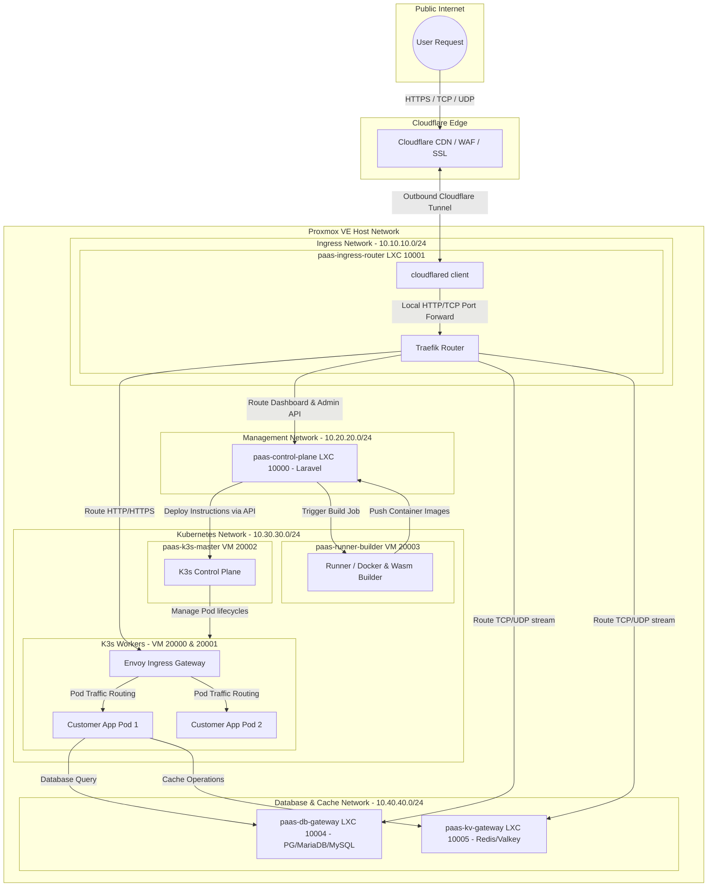
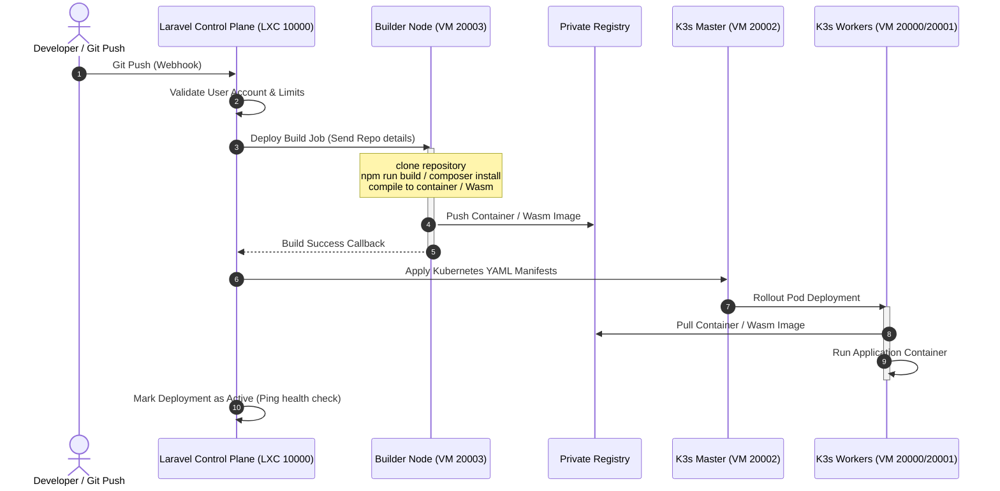

# Network and Kubernetes Architecture Design: dyzulk-cloud

This document outlines the architectural blueprint, network layout, and node configuration for the dyzulk-cloud PaaS platform running on a Debian-based Proxmox VE environment. It integrates Kubernetes (K3s) orchestration, a Laravel control plane, and a Cloudflare Tunnel-backed ingress system.

---

## 1. Ingress Router & Reverse Proxy Evaluation

To route incoming traffic (HTTP, HTTPS, TCP, UDP) into the Kubernetes cluster, we evaluate **OpenResty**, **Envoy**, and **Traefik**. Caddy has been excluded due to its stream features requiring external plugin installation.

### Comparison Matrix

| Criteria | OpenResty (Nginx + Lua) | Envoy Proxy | Traefik |
| :--- | :--- | :--- | :--- |
| **Language & Core** | C / Lua (High Performance) | C++ (Ultra-High Performance) | Go (High Performance) |
| **Kubernetes Native** | Low (Requires custom ingress controller / config reload script) | High (Via Envoy Gateway / Gateway API) | Outstanding (First-class Custom Resource Definitions / CRDs) |
| **Dynamic Configuration** | Moderate (Via Lua shared dict / APIs, but requires custom code) | Excellent (xDS API, hot restarts, zero downtime) | Excellent (Instant auto-discovery of K8s services) |
| **TCP/UDP Stream Routing** | Built-in (`ngx_stream_core_module`) | Built-in (Filter chains, SNI routing, TCP/UDP) | Built-in (`IngressRouteTCP` / `IngressRouteUDP` CRDs) |
| **Wasm Extensibility** | Limited / Experimental | Native (First-class WebAssembly filter support) | Limited (Via Go-based plugins / Yaegi interpreter) |
| **Configuration Complexity** | Moderate (Standard Nginx syntax + Lua scripts) | Extremely High (Complex bootstrap YAML / xDS configs) | Low (Declarative YAML, simple and readable) |

### Recommendation for dyzulk-cloud

We recommend a **Dual-Layer Ingress Strategy** to maximize performance, ease of use, and future extensibility:

1. **Edge Router (LXC 10001)**: Runs `cloudflared` (Cloudflare Tunnel) and **Traefik** (acting as the edge controller). Traefik receives outbound connections from Cloudflare Tunnel and routes them to the internal K3s cluster. It handles general TCP/UDP stream routing for client services (e.g. database access ports, custom TCP app protocols) easily via simple declarations.
2. **Cluster Ingress (K3s VMs)**: Runs **Envoy** (via Envoy Gateway) for routing inside the Kubernetes cluster. This prepares the platform for a WebAssembly (Wasm) architecture, allowing dynamic Wasm-based HTTP request manipulation, rate limiting, and custom headers directly at the service ingress layer.

---

## 2. Infrastructure Node Layout (Proxmox VE)

Following the standard virtualization allocation, all services run on Debian templates:
* **LXC (Linux Containers) - Range 10000+**: Used for lightweight, stateful, or administrative utility services.
* **VM (KVM Virtual Machines) - Range 20000+**: Used for Kubernetes nodes, runners, and compute workloads requiring full kernel isolation and advanced networking.

### Virtual Machine & Container Mapping

| ID | Node Name | OS Template | Type | IP Allocation | Purpose / Role |
| :--- | :--- | :--- | :--- | :--- | :--- |
| **10000** | `paas-control-plane` | Debian | LXC | `10.20.20.10` | Laravel Control Plane (Dashboard, Billing, API, Git webhooks) |
| **10001** | `paas-ingress-router` | Debian | LXC | `10.10.10.10` | Edge Ingress: Cloudflare Tunnel (`cloudflared`) and Traefik |
| **10004** | `paas-db-gateway` | Debian | LXC | `10.40.40.10` | Database Node: PostgreSQL, MariaDB, MySQL (Serverless APIs / Proxy) |
| **10005** | `paas-kv-gateway` | Debian | LXC | `10.40.40.20` | Key-Value Node: Redis Cluster / Valkey (Serverless Proxy) |
| **20002** | `paas-k3s-master` | Debian | VM | `10.30.30.10` | K3s Master (Kubernetes Control Plane) |
| **20003** | `paas-runner-builder` | Debian | VM | `10.30.30.20` | CI/CD Runner / Builder Node (Docker / Wasm compilation compiler) |
| **20000** | `paas-worker-1` | Debian | VM | `10.30.30.11` | K3s Worker Node 1 (Customer web service workloads) |
| **20001** | `paas-worker-2` | Debian | VM | `10.30.30.12` | K3s Worker Node 2 (Customer web service workloads) |

---

## 3. Network Architecture & Traffic Flow

The network is partitioned into distinct subnets to isolate administrative, compute, and database traffic:
* **Public Ingress Subnet (`10.10.10.0/24`)**: Contains the Edge Ingress Router. Directly communicates with Cloudflare via outbound tunnel.
* **Management & Control Subnet (`10.20.20.0/24`)**: Contains the Laravel Control Plane. Orchestrates virtual machines and interacts with the Kubernetes API.
* **Kubernetes Internal Subnet (`10.30.30.0/24`)**: K3s Master, Workers, and Builder nodes.
* **Storage & Database Subnet (`10.40.40.0/24`)**: Databases and Key-Value stores.

### Traffic Flow Diagram

---

## 4. Detailed Node Specifications

### 4.1 Ingress Router (`paas-ingress-router` - LXC 10001)
* **Configuration**: Runs `cloudflared` daemon and Traefik.
* **Role**:
  * Establishes outbound connections to Cloudflare Edge.
  * Terminates and parses incoming hostnames.
  * Directs web traffic to Envoy inside the K3s cluster.
  * Directs specific TCP/UDP ports directly to the database/key-value nodes (serving as a proxy gate for external client connections).
* **Network Isolation**: Dual-homed on `10.10.10.0/24` and `10.30.30.0/24`.

### 4.2 Control Plane (`paas-control-plane` - LXC 10000)
* **Configuration**: Nginx + PHP-FPM (Laravel Application).
* **Role**:
  * Houses the management database for dyzulk-cloud (customers, billings, deployments metadata).
  * Recieves webhook notifications from GitHub/GitLab.
  * Manages the K3s API by issuing kubectl commands or using the Kubernetes client SDK.
  * Orchestrates builder triggers and monitors deployment health.

### 4.3 Node Master (`paas-k3s-master` - VM 20002)
* **Configuration**: Fresh Debian VM, minimal resources (e.g. 2 Cores, 2GB RAM).
* **Role**:
  * Runs the K3s server control plane.
  * Manages node registrations, pod scheduling, and cluster state (using internal k3s datastore).
  * Exposes the K3s API securely to the Laravel Control Plane container over `10.30.30.0/24`.

### 4.4 Node Runner/Builder (`paas-runner-builder` - VM 20003)
* **Configuration**: Heavy CPU allocation, isolated from worker nodes.
* **Role**:
  * Acts as a dedicated compilation machine.
  * When a deployment is triggered:
    1. Downloads code from the repository.
    2. Runs build scripts (e.g. `npm run build`, `composer install`).
    3. Packages the application into a Docker image or compiles it to a WebAssembly (`.wasm`) target.
    4. Pushes the compiled image to a private container registry.
  * Keeps compilation overhead away from worker nodes to ensure stable customer service performance.

### 4.5 Node Worker (`paas-worker-1` & `paas-worker-2` - VMs 20000 & 20001)
* **Configuration**: Fresh Debian VMs, high RAM allocation, optimized container runtime.
* **Role**:
  * Runs the `k3s agent`.
  * Hosts customer pods.
  * Runs the Envoy Ingress Proxy to load-balance traffic among customer pods inside the node.
  * Strictly stateless and clean: developer toolchains are absent.

### 4.6 Node Databases (`paas-db-gateway` - LXC 10004)
* **Configuration**: PostgreSQL, MariaDB, and MySQL engines.
* **Role**:
  * Standard database hosting for customers.
  * Integrated with a serverless gateway proxy (e.g. PgBouncer for PostgreSQL, ProxySQL for MySQL/MariaDB) to support serverless connection pooling, instantaneous scaling, and HTTP API access (like Neon/Supabase).

### 4.7 Node Key-Value / Redis (`paas-kv-gateway` - LXC 10005)
* **Configuration**: Redis / Valkey instances.
* **Role**:
  * Serving serverless key-value access.
  * Managed via an API gateway to enable HTTP/REST-based access (like Upstash) for serverless applications and Wasm modules.

---

## 5. Control Plane Integration & Automation Flow

---

## 6. Recommended Action Plan

1. **Debian Template Creation**: Standardize a Debian cloud-init template on Proxmox for VM and LXC.
2. **Ingress Setup**: Deploy the `paas-ingress-router` container, install Traefik and `cloudflared`, and map them to the Cloudflare Zero Trust account.
3. **K3s Initialization**: Install K3s server on `paas-k3s-master` (without default Traefik to avoid conflicts, e.g., `curl -sfL https://get.k3s.io | INSTALL_K3S_EXEC="--disable traefik" sh -`).
4. **Worker Attachment**: Install K3s agents on `paas-worker-1` and `paas-worker-2` and point them to the master.
5. **Control Plane Wiring**: Configure the Laravel application on `paas-control-plane` to communicate with the K3s cluster via Kubeconfig, and wire up database/Redis provisioning logic.
