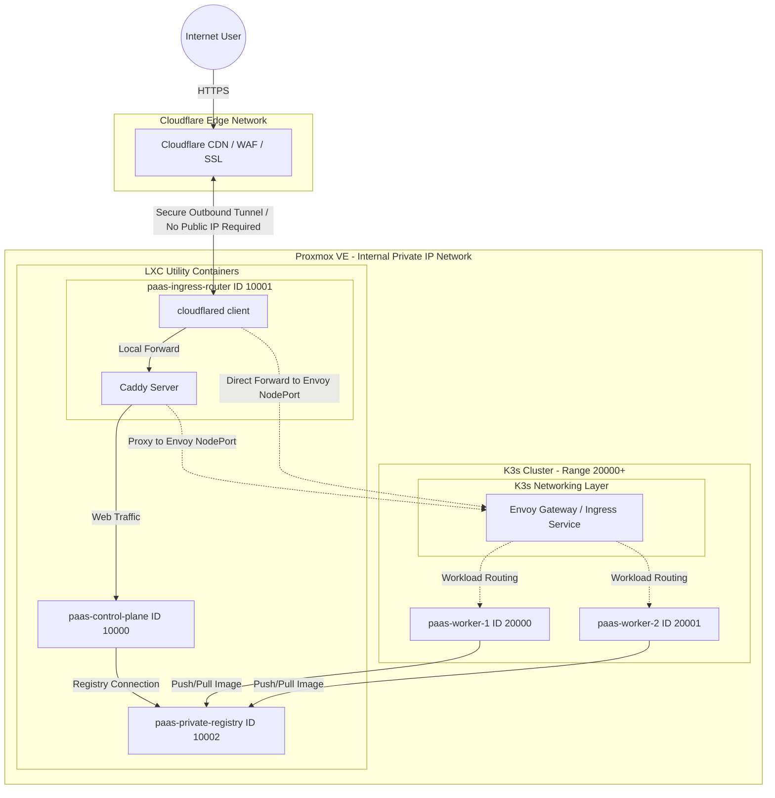

# Proxmox VM and LXC Infrastructure Architecture

This document details the virtualization infrastructure configuration used to support the dyzulk-cloud PaaS platform on your Proxmox cluster.

## Virtualization ID Allocation Mappings
According to the standardization decision (Option 3), virtualization ID ranges are separated by resource type to simplify management and automation:
* LXC (Linux Container) is allocated to the range 10000+ (used for control plane, ingress, registry, and utility services).
* VM (KVM Virtual Machine) is allocated to the range 20000+ (used for worker/runner nodes that run the user container workloads).

## Virtual Resource Details
1. paas-control-plane (LXC - ID 10000)
   * IP Address (DHCP): 10.20.20.10
   * MAC Address: BC:24:11:6B:75:FF
   * Role: Main Laravel control dashboard, billing, Git webhook handler, and state management.

2. paas-ingress-router (LXC - ID 10001)
   * IP Address (DHCP): 10.10.10.10
   * MAC Address: BC:24:11:D5:1A:5E
   * Role: Main Ingress Gateway. Runs Caddy Server as an internal reverse proxy and the dedicated Cloudflare Tunnel agent (cloudflared) for PaaS traffic.

3. paas-private-registry (LXC - ID 10002)
   * IP Address (DHCP): Accessible via Ingress port 5000
   * MAC Address: BC:24:11:71:D7:1C
   * Role: Stores user application Docker images locally and privately.

4. paas-worker-1 (VM - ID 20000)
   * IP Address (DHCP): 10.30.30.11
   * MAC Address: BC:24:11:00:F8:26
   * Role: First runner node for running user application containers.

5. paas-worker-2 (VM - ID 20001)
   * IP Address (DHCP): 10.30.30.12
   * MAC Address: BC:24:11:5E:1A:AB
   * Role: Second runner node for user application workloads.

---

## Cloudflare Tunnel Architecture Illustration (No Public IP)
Below is a visual layout of how external traffic enters your local Proxmox cluster through the secure Cloudflare Tunnel (cloudflared) running inside paas-ingress-router (LXC 10001):

---

## K3s + Envoy Readiness Audit (Node Configuration Status)

If you plan to deploy K3s (Kubernetes) with Envoy Proxy on this Proxmox cluster, it is highly recommended that nodes designated as the K3s control plane or worker nodes remain in a clean state (default/fresh installation) to prevent port conflicts (such as 80, 443, 6443, 10250) and runtime/firewall clashes (such as Docker vs Containerd).

Based on the direct scan of active VMs and LXCs in your cluster, here is the readiness status:

### 1. Worker Nodes (VMs) - Ready for K3s
* paas-worker-1 (VM 20000): Clean / Default (Fresh)
  * Audit Status: Docker, Containerd, Nginx, Caddy, or PHP are not found.
  * Readiness: Fully ready to be used as a K3s Node.
* paas-worker-2 (VM 20001): Clean / Default (Fresh)
  * Audit Status: Docker, Containerd, Nginx, Caddy, or PHP are not found.
  * Readiness: Fully ready to be used as a K3s Node.

### 2. Control & Ingress LXCs - Configured
* paas-control-plane (LXC 10000): Configured (Laravel + Nginx + PHP)
  * Audit Status: Runs Nginx and PHP-FPM for the Laravel Dashboard.
  * Readiness: Not recommended as a K3s Node due to default LXC isolation limits for Kubernetes and potential port/service conflicts with Laravel. Keep this container separate as your platform's API/dashboard database and backend.
* paas-ingress-router (LXC 10001): Configured (cloudflared + Caddy)
  * Audit Status: Runs Caddy Server as a reverse proxy and the Cloudflare Tunnel agent (cloudflared).
  * Readiness: Actively serves the PaaS tunnel. When migrating to Envoy in K3s, Caddy inside this container can either be configured to forward traffic to Envoy or disabled entirely if the cloudflared tunnel is routed directly to the internal IP of Envoy.
* paas-private-registry (LXC 10002): Configured (Docker Registry)
  * Audit Status: Dedicated local storage for private Docker images.
  * Readiness: Keep active. K3s can be configured via `registries.yaml` to trust this local registry for image pulling.

---

## Special Analysis for Private IP & Cloudflare Tunnel Architecture
Since your local network has no public IP, the integration of K3s and Envoy Proxy features the following unique characteristics:

### 1. Traffic Ingress Flow
* All incoming web traffic from the public internet to the PaaS is managed centrally by the `cloudflared` agent running inside paas-ingress-router (LXC 10001).
* The `cloudflared` agent makes outbound secure connections to the Cloudflare Edge network, eliminating the need to expose ports on your local router.

### 2. K3s + Envoy Integration Scenarios
There are three main integration paths after K3s and Envoy are deployed on VM 20000 and 20001:

* Skenario A (Tiered Proxy via Caddy):
  * The `cloudflared` agent in LXC 10001 forwards traffic to Caddy (local to LXC 10001).
  * Caddy is reconfigured to reverse proxy from LXC 10001 to the Envoy Ingress Service running on the K3s VM IP (e.g., `http://10.30.30.11:NodePort`).
  * Pros: Easy to implement without changing existing Cloudflare Tunnel configurations in the Zero Trust dashboard.

* Skenario B (Direct Tunnel from LXC 10001 to Envoy):
  * In the Cloudflare Zero Trust dashboard, change the routing target (Service URL) of the LXC 10001 tunnel directly to the internal IP of the K3s VM (e.g., `http://10.30.30.11:NodePort` or the internal K3s LoadBalancer IP).
  * Caddy in LXC 10001 can be disabled entirely.
  * Pros: Direct traffic path, bypassing Caddy for better efficiency.

* Skenario C (Kubernetes-Native Tunnel):
  * Run the `cloudflared` agent directly inside the K3s cluster as a Deployment.
  * The tunnel connects directly to the Envoy Service using internal Kubernetes DNS.
  * Pros: Centralized management within Kubernetes; LXC 10001 can be fully decommissioned.

### Conclusion & Recommended Actions:
* **Is it necessary to destroy non-fresh VMs/LXCs?**
  * **Not needed for worker VMs (20000 & 20001)**, as they are currently clean (default/fresh) with no web server or container runtimes installed. K3s can be installed directly.
  * **Not needed for paas-control-plane (10000)**, as your Laravel dashboard must remain running for handling database and API processes. It can safely run outside the Kubernetes cluster.
  * **Only requires adjusting routing configurations in LXC 10001** (using Scenario A or B) to direct traffic to the Envoy proxy running on the K3s cluster.
