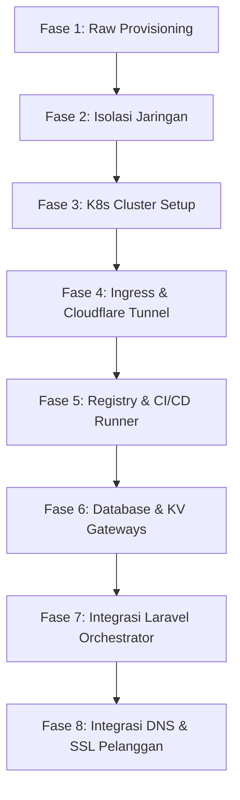

# Panduan Alur dan Daftar Tugas Pembangunan Platform PaaS (Roadmap)

Dokumen ini mendokumentasikan seluruh peta jalan (roadmap), proses logis, dan daftar tugas (checklist) terperinci yang diperlukan untuk membangun platform PaaS dyzulk-cloud dari awal hingga selesai.

---

## 1. Peta Jalan Pembangunan Platform (Roadmap)

Pembangunan platform dibagi menjadi 8 fase berurutan:



---

## 2. Rincian Langkah & Daftar Tugas (Tasks Checklist)

### Fase 1: Penyediaan Infrastruktur Dasar (Selesai)
Tujuan: Membuat kontainer LXC dan VM dasar di Proxmox dengan ID berurutan.
* [x] Buat kontainer LXC `10000` - `10004` menggunakan templat Debian 13 standar (`debian-13-standard_13.6-1_amd64.tar.zst`).
* [x] Aktifkan fitur `nesting=1` pada seluruh LXC agar systemd berjalan sempurna.
* [x] Kloning VM `20000` - `20003` dari templat Debian 13 Cloud-Init (`debian-13-cloudinit-template` ID `9001`).
* [x] Atur alokasi resource hardware (CPU, RAM, Disk) dan IP statis per VM.
* [x] Nyalakan semua instansi dan verifikasi status aktif (*running*).

### Fase 2: Konfigurasi Jaringan & Isolasi Subnet (VLAN)
Tujuan: Memastikan setiap subnet terisolasi secara logis menggunakan VLAN tagging pada bridge `vmbr0`.
* [ ] Konfigurasi VLAN Tag pada Proxmox Host:
  * VLAN 10: Ingress Subnet (`10.10.10.0/24`)
  * VLAN 20: Management Subnet (`10.20.20.0/24`)
  * VLAN 30: Kubernetes Subnet (`10.30.30.0/24`)
  * VLAN 40: Storage Subnet (`10.40.40.0/24`)
* [ ] Pastikan tidak ada rute langsung antara VLAN 40 (Database) ke VLAN 10 (Ingress/Internet).
* [ ] Pastikan VLAN 20 (Laravel Control Plane) memiliki akses penuh ke VLAN 30 (K8s API) dan VLAN 40 (Database).

### Fase 3: Inisialisasi Kubernetes Cluster (K8s kubeadm)
Tujuan: Membangun klaster Kubernetes standar menggunakan runtime containerd.
* [ ] Konfigurasi Pra-syarat pada K8s Master (`20000`) dan Workers (`20002`, `20003`):
  * Matikan swap (`swapoff -a` dan hapus dari `/etc/fstab`).
  * Aktifkan module kernel `overlay` dan `br_netfilter`.
  * Konfigurasi parameter sysctl untuk penjelajahan jaringan jembatan (*bridge netfilter*).
* [ ] Container Runtime (containerd):
  * Konfigurasi containerd untuk menggunakan driver cgroup `systemd`.
  * Restart dan verifikasi containerd running.
* [ ] Instalasi kubeadm, kubelet, dan kubectl versi stabil terbaru.
* [ ] Inisialisasi K8s Master:
  * Jalankan `kubeadm init` dengan menentukan rentang CIDR Pod (misal: `--pod-network-cidr=10.244.0.0/16`).
  * Konfigurasi Kubeconfig untuk user admin.
* [ ] Pasang CNI (Flannel atau Calico):
  * Jalankan `kubectl apply -f [cni-manifest-url]`.
* [ ] Hubungkan Node Worker (`paas-worker-1` & `paas-worker-2`) ke Master menggunakan perintah `kubeadm join` yang dihasilkan oleh Master.

### Fase 4: Ingress Controller & Cloudflare Tunnel
Tujuan: Menghubungkan trafik publik melalui Cloudflare Tunnel langsung ke Traefik Ingress Controller di dalam klaster K8s.
* [ ] Deploy Traefik Ingress Controller di klaster K8s:
  * Gunakan Helm untuk memasang Traefik.
  * Konfigurasi service Traefik ke tipe `NodePort` dengan port statis (HTTP: `30080`, HTTPS: `30443`).
* [ ] Konfigurasi `paas-ingress-router` (LXC 10000):
  * Pasang paket `cloudflared`.
  * Autentikasi dan buat Cloudflare Tunnel baru khusus untuk platform PaaS Anda.
  * Buat file konfigurasi `/etc/cloudflared/config.yml` yang mengarahkan trafik inbound HTTP (`*`) ke IP Worker Node (`10.30.30.11:30080` dan `10.30.30.12:30080`) dengan load balancing internal atau failover sederhana.
  * Aktifkan layanan systemd `cloudflared` agar otomatis berjalan saat booting.

### Fase 5: Set Up Container Registry & CI/CD Runner Builder
Tujuan: Membangun sistem build image kontainer dan penyimpanan privat yang terintegrasi.
* [ ] Konfigurasi `paas-private-registry` (LXC 10002):
  * Pasang Docker engine.
  * Jalankan kontainer `registry:2` secara lokal.
  * Hubungkan folder `/var/lib/registry` kontainer ke Bind Mount HDD 2TB host (`/mnt/pve/xhdd1/...` atau `/mnt/pve/hdd2tb/...`) untuk menghemat SSD.
* [ ] Konfigurasi `paas-runner-builder` (VM 20001):
  * Pasang Docker engine atau podman/buildah untuk build engine.
  * Pasang runner agent (misalnya GitHub Runner, GitLab Runner, atau SSH worker handler Laravel).
* [ ] Pengaturan Sertifikat SSL Lokal/Self-Signed:
  * Buat sertifikat SSL lokal agar registry menggunakan HTTPS, ATAU konfigurasi semua node K8s dan Runner untuk mengizinkan registry ini dalam daftar `insecure-registries` pada config containerd/Docker.

### Fase 6: Penyediaan Database & Cache Gateways (PaaS Storage)
Tujuan: Menyiapkan gateway database internal yang hanya dapat diakses secara privat oleh aplikasi pelanggan.
* [ ] Konfigurasi `paas-db-gateway` (LXC 10003):
  * Instalasi mesin database: PostgreSQL, MariaDB, dan MySQL.
  * Konfigurasi bind address ke IP lokal subnet database (`10.40.40.10`).
  * Pasang connection pooler (PgBouncer untuk PostgreSQL) agar efisien dalam menangani banyak koneksi jangka pendek dari pod aplikasi pelanggan.
* [ ] Konfigurasi `paas-kv-gateway` (LXC 10004):
  * Instalasi Valkey / Redis.
  * Konfigurasi bind address ke IP lokal subnet database (`10.40.40.20`).
  * Pasang lightweight REST API proxy (misalnya Webdis) agar aplikasi serverless atau modul WebAssembly (Wasm) dapat mengakses cache via panggilan HTTP/REST tanpa driver TCP berat.

### Fase 7: Setup Laravel Control Plane (Orchestration Engine)
Tujuan: Menjadikan Laravel sebagai otak pengendali (Control Plane) yang mengendalikan siklus deployment.
* [ ] Konfigurasi Laravel App di `paas-control-plane` (LXC 10001):
  * Instalasi Nginx, PHP-FPM, Composer, dan Node.js/NPM.
  * Konfigurasi database internal Laravel dan setup antrean queue (Redis/Database queue worker).
* [ ] Wiring K8s API ke Laravel:
  * Salin file `/etc/kubernetes/admin.conf` (Kubeconfig) dari K8s Master ke direktori privat Laravel.
  * Pasang library client Kubernetes PHP (atau gunakan pemanggilan CLI `kubectl` via Symfony Process).
  * Buat model database untuk mendata aplikasi pelanggan, status deployment, custom domain, dan port.
* [ ] Implementasi Webhook Handler:
  * Buat endpoint webhook Git di Laravel untuk menerima notifikasi push dari GitHub/GitLab.
  * Tulis logika otomatisasi: Push git diterima -> Buat entri Deployment baru -> Trigger antrean build job.

### Fase 8: Siklus Deployment Otomatis & Integrasi Domain Pelanggan
Tujuan: Mengintegrasikan proses kompilasi kode, penerbitan manifes K8s, dan alokasi custom domain secara otomatis.
* [ ] Integrasi Alur Kerja Pipeline (CI/CD):
  * Job 1 (Build): Laravel memicu build di `paas-runner-builder` -> kloning repositori kode pelanggan -> jalankan kompilasi (`npm run build`/`composer install`) -> buat Dockerfile otomatis -> build container image -> push ke `paas-private-registry`.
  * Job 2 (Deploy): Setelah build sukses, Laravel membuat manifes Kubernetes YAML dinamis (Deployment, Service, Ingress) -> terapkan ke K8s Master -> Workers mengunduh image dari registry -> Pods running.
* [ ] Integrasi Cloudflare for SaaS (Custom Hostnames):
  * Konfigurasi Fallback Origin di Cloudflare untuk mengarah ke DNS Tunnel ID Anda.
  * Integrasikan API SDK Cloudflare di Laravel. Ketika pelanggan mendaftarkan domain mereka (misal: `app.customer.com`), Laravel secara otomatis memanggil Cloudflare API untuk mendaftarkan Custom Hostname dan menerbitkan SSL otomatis.
  * Traefik mendeteksi Host Header `app.customer.com` melalui Ingress K8s dan mengarahkan trafik ke Pod aplikasi pelanggan yang tepat.

---

## 3. Alur Komunikasi Sistem & Aliran Trafik

```text
[Pelanggan / Pengunjung]
       │
       ▼ (HTTPS)
[Cloudflare Edge] (SSL & Custom Hostnames)
       │
  (Outbound Tunnel Tunnel ID)
       │
       ▼
[paas-ingress-router (10.10.10.10)] (cloudflared client)
       │
  (Forward ke NodePort HTTP - Port 30080)
       │
       ▼
[paas-worker-1 / paas-worker-2 (10.30.30.11/12)] (Traefik Ingress Controller)
       │
  (Rute Internal K8s)
       │
       ▼
[Customer App Pod]
       │
  (Akses Database / Cache internal - VLAN 40)
       ├───► [paas-db-gateway (10.40.40.10)]
       └───► [paas-kv-gateway (10.40.40.20)]
```
