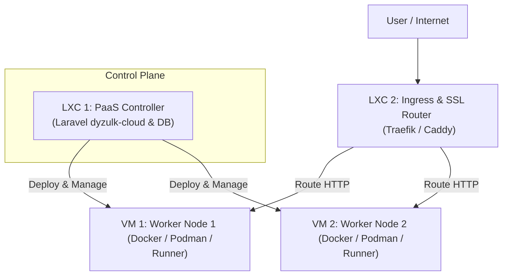

# Analisis Proyek dan Panduan Simulasi Paas (dyzulk-cloud)

Dokumen ini merangkum penjelasan mengenai proyek dyzulk-cloud serta rekomendasi arsitektur infrastruktur untuk melakukan simulasi platform PaaS (Platform as a Service) menggunakan Proxmox VE (PVE).

---

## 1. Analisis Proyek dyzulk-cloud

Proyek **dyzulk-cloud** dirancang sebagai platform PaaS (seperti Render.com atau Heroku) yang memungkinkan pengguna untuk mengelola tim, domain, dan melakukan deployment aplikasi serta manajemen sertifikat SSL secara otomatis.

### Arsitektur Aplikasi
Aplikasi ini terbagi menjadi dua panel utama:
*   **Panel Pengguna (Dashboard)**: Digunakan oleh pelanggan untuk mengelola tim (Team Management), mengundang anggota tim baru, serta meminta, mengelola, dan mengunduh sertifikat SSL (sertifikat, kunci privat, dan CSR).
*   **Panel Admin Internal (Office)**: Digunakan oleh tim internal/administrator untuk mengelola Certificate Authority (CA) internal, melakukan setup CA, serta memproses pembaruan (renewal) sertifikat.

### Teknologi yang Digunakan

| Komponen | Teknologi | Deskripsi |
| :--- | :--- | :--- |
| **Backend & Framework** | Laravel 13, PHP 8.5 | Logika aplikasi utama, perutean, antrean (queues), dan interaksi database. |
| **Autentikasi** | Laravel Fortify & Sanctum | Mengelola sesi pengguna, registrasi, token API, dan integrasi passkey. |
| **Type-Safe Routing** | Laravel Wayfinder | Menghubungkan routing Laravel secara otomatis ke TypeScript di frontend. |
| **Pengujian** | Pest PHP | Framework testing untuk pengujian unit dan fitur backend. |
| **Frontend** | React 19, TypeScript | Library utama untuk antarmuka pengguna yang responsif. |
| **SPA Bridge** | Inertia.js v3 | Menghubungkan Laravel backend dengan React tanpa memerlukan API REST tradisional yang terpisah. |
| **Styling** | TailwindCSS v4 | Framework utility-first untuk desain antarmuka. |
| **Animasi & UI** | GSAP, Radix UI, Base UI | Komponen UI aksesibel dengan transisi dan interaksi mikro yang premium. |
| **Build Tool** | Vite | Bundler untuk aset frontend selama pengembangan dan produksi. |

---

## 2. Rekomendasi Arsitektur Simulasi PaaS pada Proxmox VE

Untuk menguji platform PaaS ini secara nyata di server homelab Proxmox (Xeon E5-2673 v3 24 thread, RAM 32 GB), disarankan menggunakan kombinasi **LXC (Linux Containers)** dan **VM (Virtual Machines)** untuk memisahkan tanggung jawab sistem secara optimal.

### Diagram Arsitektur Simulasi

### Rincian VM / LXC yang Dibutuhkan

#### Instance 1: LXC 1 - Control Plane & Database
*   **Peran**: Menjalankan aplikasi Laravel (`dyzulk-cloud`), database (PostgreSQL/MySQL), Redis untuk antrean job, dan mengontrol siklus hidup deployment aplikasi pengguna.
*   **Tipe**: LXC (Linux Container) karena memiliki overhead sangat rendah dan efisien untuk aplikasi PHP/Database.
*   **Alokasi Resource**: 2-4 vCPU, 4 GB RAM, 20 GB Disk (SSD/NVMe).

#### Instance 2: LXC 2 - Ingress Router & SSL Terminator
*   **Peran**: Bertindak sebagai reverse proxy (menggunakan Traefik, Caddy, atau OpenResty/Nginx). Menerima trafik dari luar, mencocokkan domain aplikasi user, menangani sertifikat SSL secara dinamis (menggunakan CA yang dikelola proyek Anda), lalu meneruskan trafik ke Worker Node yang tepat.
*   **Tipe**: LXC.
*   **Alokasi Resource**: 1-2 vCPU, 2 GB RAM, 10 GB Disk (SSD).

#### Instance 3: VM 1 - Worker Node 1
*   **Peran**: Host tempat aplikasi milik pengguna dibangun (build) dan dijalankan dalam bentuk kontainer (Docker/Podman/Nomad runner).
*   **Tipe**: VM (Virtual Machine).
*   **Alokasi Resource**: 4 vCPU, 6-8 GB RAM, 40 GB Disk (SSD/NVMe).
*   **Catatan Keamanan**: Penggunaan VM (bukan LXC) sangat penting untuk mengisolasi kernel aplikasi pengguna dari sistem host utama (mencegah container breakout).

#### Instance 4: VM 2 - Worker Node 2
*   **Peran**: Worker node kedua untuk mensimulasikan fitur *High Availability (HA)*, *zero-downtime rolling update*, dan *load balancing* ketika aplikasi pengguna diskalakan ke beberapa server sekaligus.
*   **Tipe**: VM (Virtual Machine).
*   **Alokasi Resource**: 4 vCPU, 6-8 GB RAM, 40 GB Disk (SSD/NVMe).

---

## 3. Estimasi Total Penggunaan Resource PVE

*   **CPU**: 11 - 14 vCPU teralokasi (dari total 24 thread Xeon). Sangat aman dari risiko bottleneck CPU.
*   **RAM**: 18 - 22 GB terpakai (menyisakan sisa RAM sekitar 10 GB pada Proxmox untuk kebutuhan sistem PVE).
*   **Penyimpanan**: Alokasikan sekitar 110 GB di media penyimpanan cepat (SSD/NVMe) untuk disk VM/LXC agar proses build aplikasi (Docker build) berjalan cepat. Penyimpanan statis atau cadangan dapat diarahkan ke HDD 1TB menggunakan Mount Point.
