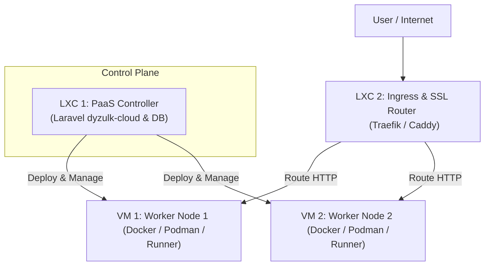

# Project Analysis and PaaS Simulation Guide (dyzulk-cloud)

This document summarizes the explanation of the dyzulk-cloud project and recommends an infrastructure architecture for simulating the PaaS (Platform as a Service) platform using Proxmox VE (PVE).

---

## 1. dyzulk-cloud Project Analysis

The **dyzulk-cloud** project is designed as a PaaS platform (similar to Render.com or Heroku) that allows users to manage teams, domains, automatically deploy applications, and manage SSL certificates.

### Application Architecture
The application is split into two main panels:
* **User Panel (Dashboard)**: Used by customers to manage teams (Team Management), invite new members, and request, manage, and download SSL certificates (certificate, private key, and CSR).
* **Internal Admin Panel (Office)**: Used by internal teams/administrators to manage the internal Certificate Authority (CA), set up the CA, and process certificate renewals.

### Technology Stack

| Component | Technology | Description |
| :--- | :--- | :--- |
| **Backend & Framework** | Laravel 13, PHP 8.5 | Main application logic, routing, queues, and database interactions. |
| **Authentication** | Laravel Fortify & Sanctum | Manages user sessions, registration, API tokens, and passkey integrations. |
| **Type-Safe Routing** | Laravel Wayfinder | Automatically connects Laravel routing to TypeScript in the frontend. |
| **Testing** | Pest PHP | Testing framework for unit and backend feature tests. |
| **Frontend** | React 19, TypeScript | Main library for responsive user interfaces. |
| **SPA Bridge** | Inertia.js v3 | Connects the Laravel backend with React without requiring a separate traditional REST API. |
| **Styling** | TailwindCSS v4 | Utility-first framework for interface design. |
| **Animation & UI** | GSAP, Radix UI, Base UI | Accessible UI components with premium transitions and micro-interactions. |
| **Build Tool** | Vite | Bundler for frontend assets during development and production. |

---

## 2. Recommended PaaS Simulation Architecture on Proxmox VE

To test this PaaS platform in a real environment on a homelab Proxmox server (Xeon E5-2673 v3 with 24 threads, 32 GB RAM), it is recommended to use a combination of **LXC (Linux Containers)** and **VM (Virtual Machines)** to optimally separate system responsibilities.

### Simulation Architecture Diagram

### Required VM / LXC Details

#### Instance 1: LXC 1 - Control Plane & Database
* **Role**: Runs the Laravel application (`dyzulk-cloud`), database (PostgreSQL/MySQL), Redis for job queues, and controls the deployment lifecycle of user applications.
* **Type**: LXC (Linux Container) due to very low overhead and high efficiency for PHP/Database applications.
* **Resource Allocation**: 2-4 vCPUs, 4 GB RAM, 20 GB Disk (SSD/NVMe).

#### Instance 2: LXC 2 - Ingress Router & SSL Terminator
* **Role**: Acts as a reverse proxy (using Traefik, Caddy, or OpenResty/Nginx). It receives external traffic, matches user application domains, handles SSL certificates dynamically (using CAs managed by your project), and forwards traffic to the appropriate Worker Node.
* **Type**: LXC.
* **Resource Allocation**: 1-2 vCPUs, 2 GB RAM, 10 GB Disk (SSD).

#### Instance 3: VM 1 - Worker Node 1
* **Role**: Host environment where user applications are built and run as containers (Docker/Podman/Nomad runner).
* **Type**: VM (Virtual Machine).
* **Resource Allocation**: 4 vCPUs, 6-8 GB RAM, 40 GB Disk (SSD/NVMe).
* **Security Note**: Using a VM (not an LXC) is critical to isolate the kernel of user applications from the host system (preventing container breakout).

#### Instance 4: VM 2 - Worker Node 2
* **Role**: Second worker node to simulate High Availability (HA), zero-downtime rolling updates, and load balancing when user applications are scaled across multiple servers.
* **Type**: VM (Virtual Machine).
* **Resource Allocation**: 4 vCPUs, 6-8 GB RAM, 40 GB Disk (SSD/NVMe).

---

## 3. Estimated Total PVE Resource Usage

* **CPU**: 11 - 14 vCPUs allocated (out of a total 24 Xeon threads). Safe from CPU bottlenecks.
* **RAM**: 18 - 22 GB used (leaving around 10 GB of RAM free on Proxmox for PVE system requirements).
* **Storage**: Allocate about 110 GB on fast storage media (SSD/NVMe) for VM/LXC disks to ensure fast application builds (Docker build). Static storage or backups can be directed to a 1TB HDD using Mount Points.
